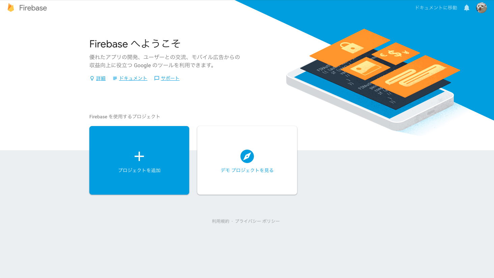
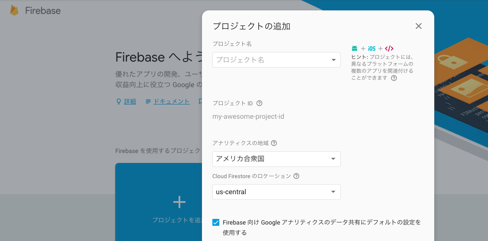
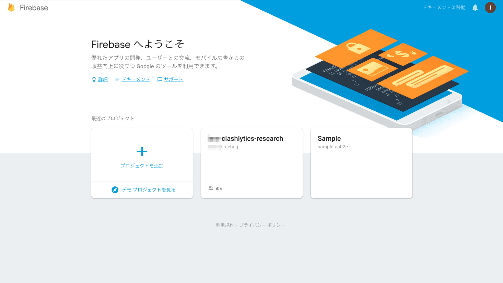
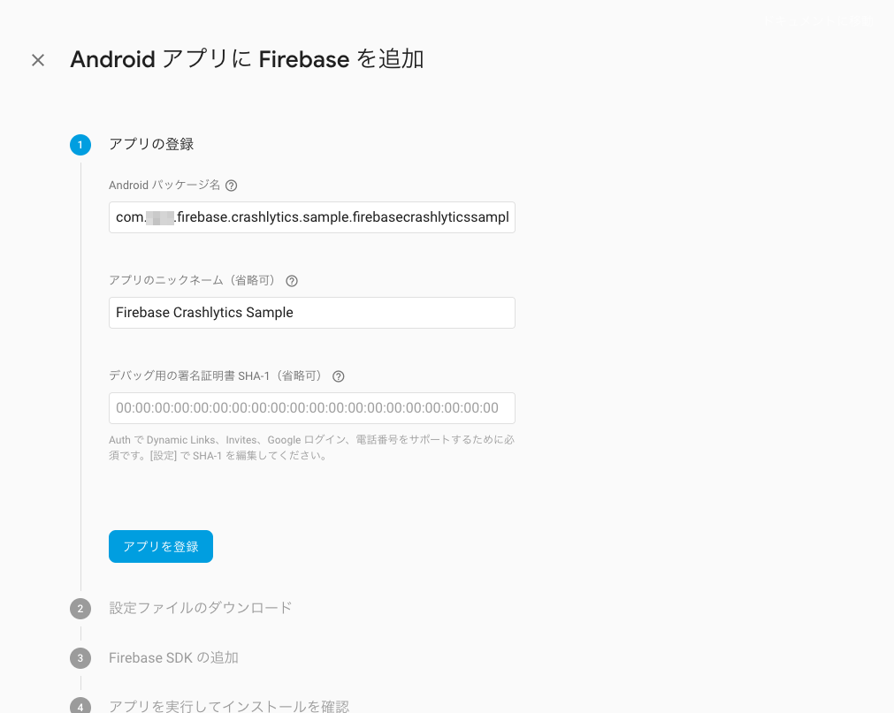
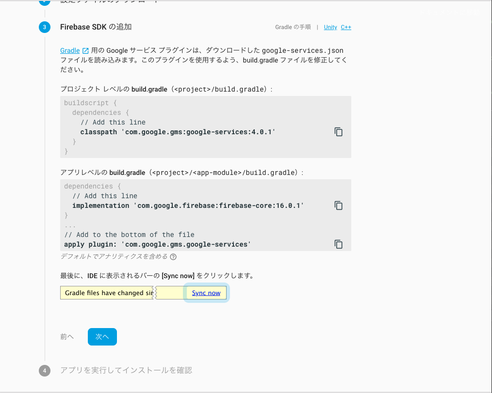
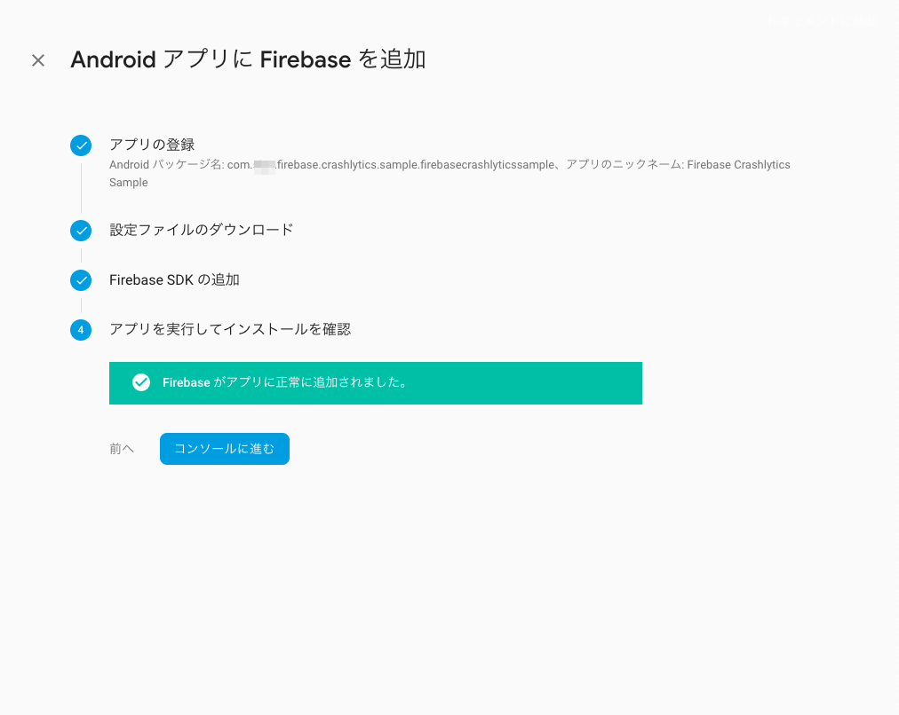
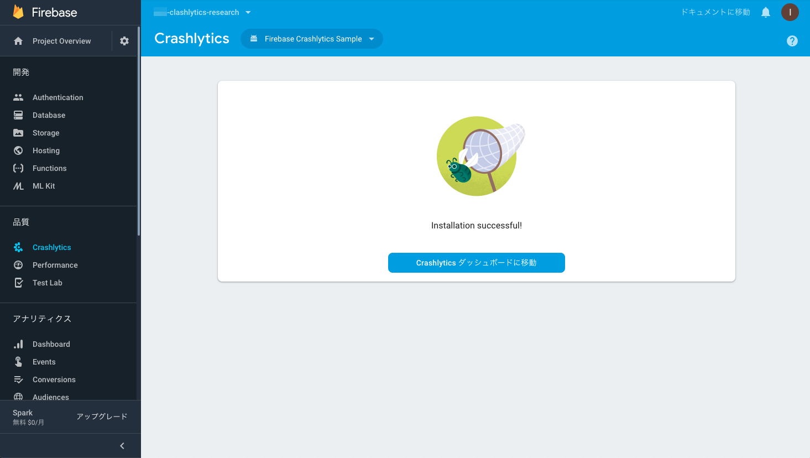
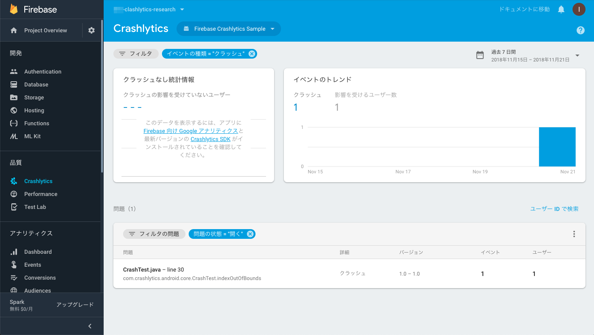

# How To Install Crashlytics

---

## Firebaseプロジェクト作成手順

*はじめに、Firebase Console上で、プロジェクトの作成を行います。なお、Firebase Consoleにアクセスするためには、Googleアカウントが必要となりますが、すでに、取得しており、Firebase Consoleにアクセスできるものとします。また、本書では、本項を通して、作成したFirebaseのプロジェクトに、後述のサンプルアプリを登録するという流れを取らせていただきます。*

1. Firebase Consoleを開いて、`Projectの追加`をクリックします



2. 必要事項を入力して、`プロジェクトを作成`をクリックします



プロジェクトの作成が完了すると以下のように、当該プロジェクトへのリンクが、メニューに表示されます。
なお、本項では、`iem-clashlytics-research`という名前のプロジェクトを作成しました。



---

## Android版Crashlytics導入手順

*本項では、AndroidアプリにCrashlyticsを導入する手順として、[サンプルアプリ](./FirebaseCrashlyticsSampleForAndroid)への導入を通して得た知見を説明します。*

###アプリにCrashliyticsのライブラリを追加します

* build.gradle

	```
	// Top-level build file where you can add configuration options common to all sub-projects/modules.
	
	buildscript {
	    
	    repositories {
	
	+         // Add repository
	+         maven {
	+             url 'https://maven.fabric.io/public'
	+         }
	
	        google()
	        jcenter()
	    }
	    dependencies {
	
	        classpath 'com.android.tools.build:gradle:3.2.1'
	
	+         // Check for v3.1.2 or higher
	+         classpath 'com.google.gms:google-services:4.1.0'
	 
	+         // Add dependency
	+         classpath 'io.fabric.tools:gradle:1.25.4'
	
	    }
	}
	
	allprojects {
	    repositories {
	
	+         // Add repository
	+         maven {
	+             url 'https://maven.fabric.io'
	+         }
	
	        google()
	        jcenter()
	    }
	}
	
	task clean(type: Delete) {
	    delete rootProject.buildDir
	}
	
	```

* app/build.gradle
	
	```
	apply plugin: 'com.android.application'
	+ apply plugin: 'io.fabric'
	+ apply plugin: 'com.google.gms.google-services'
	
	android {
	    compileSdkVersion 28
	    defaultConfig {
	        applicationId "com.sips.firebase.crashlytics.sample.firebasecrashlyticssample"
	        minSdkVersion 22
	        targetSdkVersion 28
	        versionCode 1
	        versionName "1.0"
	        testInstrumentationRunner "android.support.test.runner.AndroidJUnitRunner"
	    }
	    buildTypes {
	        release {
	            minifyEnabled false
	            proguardFiles getDefaultProguardFile('proguard-android.txt'), 'proguard-rules.pro'
	        }
	    }
	}
	
	dependencies {
	    implementation fileTree(dir: 'libs', include: ['*.jar'])
	    implementation 'com.android.support:appcompat-v7:28.0.0'
	    implementation 'com.android.support.constraint:constraint-layout:1.1.3'
	    testImplementation 'junit:junit:4.12'
	    androidTestImplementation 'com.android.support.test:runner:1.0.2'
	    androidTestImplementation 'com.android.support.test.espresso:espresso-core:3.0.2'
	
	+     // Check for v11.4.2 or higher
	+     implementation 'com.google.firebase:firebase-core:16.0.4'
	
	+     // Add dependency
	+     implementation 'com.crashlytics.sdk.android:crashlytics:2.9.5'
	
	}
	```

###Firebase Console上に作成したプロジェクトへアプリを登録します

当作業は、`Firebase Console > 対象プロジェクト > プロジェクトの設定 > アプリを追加`を開いて行います。	


当画面には、手順も併記されていますので、記載どおりに作業をします。
また、この作業は、基本的に、Android Package名が変わることがなければ、一度のみ行なえばよいです。

Step 1. 必要事項を入力して`アプリを登録`します
​	

​	
Step 2. google-services-jsonファイルを取得して、Androidプロジェクトに配置します


Step 3. Firebase SDKは追加済みなので先へ進みます



Step 4. 初期状態では、Waitingしていますので、Android Studio上で、アプリをRunします。
​	

​	
アプリが起動されたら、以下のようなメッセージが表示されます。
切り替わらない場合は、複数回、アプリを起動し直してください。
（インターネットに接続できる環境でアプリを起動する必要があります。）



###Firebase Console上で、Crashlyticsの設定をします

当作業は、`Firebase Console > 対象プロジェクト > 左メニューのClashlytics`を開いて行います。

Step 1. `このアプリではCrashlyticsを初めて使用します`を選択します
​	

​	
Step 2. すでに、SDKをインストール済みなので、Step 2は、スキップします
​	

​	
Step 3. Android Studio上で、アプリをRunします。
​	

​	
アプリが起動すると、以下の画面に切り替わります。切り替わらない場合は、複数回、アプリを起動してください。（インターネットに接続できる環境でアプリを起動する必要があります。）
​	


###Crashレポートの送信されるか確認します

1. 強制的にクラッシュを引き起こすコードをアプリの任意のソースに追加します
	
	```
	package com.sips.firebase.crashlytics.sample.firebasecrashlyticssample;
	
	import android.support.v7.app.AppCompatActivity;
	import android.os.Bundle;
	import android.view.View;
	
	+ import com.crashlytics.android.Crashlytics;
	
	public class MainActivity extends AppCompatActivity implements View.OnClickListener {
	
	    @Override
	    protected void onCreate(Bundle savedInstanceState) {
	        super.onCreate(savedInstanceState);
	        setContentView(R.layout.activity_main);
	    }
	
	    @Override
	    public void onClick(View v) {
	+         Crashlytics.getInstance().crash(); // Force a crash
	    }
	
	}
	
	```
	
2. アプリをRunし、クラッシュを引き起こすコードが実行されるよう操作します

3. `Firebase Console > 対象プロジェクト > Clashlytics > 対象アプリ`を開いて、Crashレポートがアップロードされていることを確認します



###Tips & Tricks

* Debug時は、Crashレポートを収集したくない

	[https://qiita.com/YusukeIwaki/items/e767c45edad48302cec8](https://qiita.com/YusukeIwaki/items/e767c45edad48302cec8)

---

## iOS版Crashlytics導入手順

*本項では、iOSアプリにCrashlyticsを導入する手順として、[サンプルアプリ](./FirebaseCrashlyticsSampleForIOS)への導入を通して得た知見を説明します。*

###アプリにCrashliyticsのライブラリを追加します

* Cocoapods

  ```
  pod 'Firebase/Core'
  ```

* Carthage

  ```
  binary "https://dl.google.com/dl/firebase/ios/carthage/FirebaseAnalyticsBinary.json"
  ```


##Reference

[https://firebase.google.com/docs/crashlytics/?authuser=1](https://firebase.google.com/docs/crashlytics/?authuser=1)
