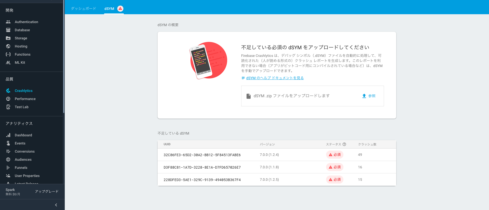

# How To Install Firebase Crashlytics


---

## Firebase Consoleにプロジェクトを作成する

Firebase Consoleにログインするためには、Googleアカウントが必要です。
本項は、Googleアカウントを取得しており、Firebase Consoleにログインしているものといたします。

1. ブラウザで、[Firebase Console](https://console.firebase.google.com)を開き、`Projectの追加`をクリックします。


2. 必要事項を入力して、`プロジェクトを作成`をクリックします。

   本項では、`clashlytics-research`という名前のプロジェクトを作成します。


プロジェクトの作成が完了すると以下のように、当該プロジェクトへのリンクが、メニューに表示されます。


なお、これ以降は、本項で作成したclashlytics-researchプロジェクト上に、iOS/Androidサンプルアプリのクラッシュレポートを収集していく流れで、説明させていただきます。

---

## AndroidアプリにCrashlytics導入する

本項では、AndroidアプリにCrashlyticsを導入する手順を[サンプルアプリ](./FirebaseCrashlyticsSampleForAndroid)を通して説明します。

###アプリにCrashliyticsのライブラリを追加する

* build.gradle

	```
	// Top-level build file where you can add configuration options common to all sub-projects/modules.
	
	buildscript {
	    
	    repositories {
	
	+         // Add repository
	+         maven {
	+             url 'https://maven.fabric.io/public'
	+         }
	
	        google()
	        jcenter()
	    }
	    dependencies {
	
	        classpath 'com.android.tools.build:gradle:3.2.1'
	
	+         // Check for v3.1.2 or higher
	+         classpath 'com.google.gms:google-services:4.1.0'
	 
	+         // Add dependency
	+         classpath 'io.fabric.tools:gradle:1.25.4'
	
	    }
	}
	
	allprojects {
	    repositories {
	
	+         // Add repository
	+         maven {
	+             url 'https://maven.fabric.io'
	+         }
	
	        google()
	        jcenter()
	    }
	}
	
	task clean(type: Delete) {
	    delete rootProject.buildDir
	}
	
	```

* app/build.gradle
	
	```
	apply plugin: 'com.android.application'
	+ apply plugin: 'io.fabric'
	+ apply plugin: 'com.google.gms.google-services'
	
	android {
	    compileSdkVersion 28
	    defaultConfig {
	        applicationId "com.xxx.firebase.crashlytics.sample.firebasecrashlyticssample"
	        minSdkVersion 22
	        targetSdkVersion 28
	        versionCode 1
	        versionName "1.0"
	        testInstrumentationRunner "android.support.test.runner.AndroidJUnitRunner"
	    }
	    buildTypes {
	        release {
	            minifyEnabled false
	            proguardFiles getDefaultProguardFile('proguard-android.txt'), 'proguard-rules.pro'
	        }
	    }
	}
	
	dependencies {
	    implementation fileTree(dir: 'libs', include: ['*.jar'])
	    implementation 'com.android.support:appcompat-v7:28.0.0'
	    implementation 'com.android.support.constraint:constraint-layout:1.1.3'
	    testImplementation 'junit:junit:4.12'
	    androidTestImplementation 'com.android.support.test:runner:1.0.2'
	    androidTestImplementation 'com.android.support.test.espresso:espresso-core:3.0.2'
	
	+     // Check for v11.4.2 or higher
	+     implementation 'com.google.firebase:firebase-core:16.0.4'
	
	+     // Add dependency
	+     implementation 'com.crashlytics.sdk.android:crashlytics:2.9.5'
	
	}
	```

###Firebase Console上に作成したプロジェクトにアプリを登録する

当作業は、`Firebase Console > 対象プロジェクト(clashlytics-research) > プロジェクトの設定 > アプリを追加`を開いて行います。	


当画面には、手順も併記されていますので、記載どおりに作業をします。
また、この作業は、基本的に、Android Package名が変わることがなければ、一度のみ行なえばよいです。

Step 1. 必要事項を入力して`アプリを登録`します。
​	

​	
Step 2. google-services-jsonファイルを取得して、Androidプロジェクトに配置(配置箇所は以下を参照)します。


Step 3. Firebase SDKは追加済みなので先へ進みます。


Step 4. 初期状態では、Waitingしていますので、Android Studio上で、アプリをRunします。
​	

​	
アプリが起動されたら、以下のようなメッセージが表示されます。
切り替わらない場合は、複数回、アプリを起動し直してください。
（インターネットに接続できる環境でアプリを起動する必要があります。）


###Firebase Console上でCrashlyticsの設定する

当作業は、`Firebase Console > 対象プロジェクト(clashlytics-research) > 左メニューのClashlytics`を開いて行います。

Step 1. `このアプリではCrashlyticsを初めて使用します`を選択します。
​	

​	
Step 2. すでに、SDKをインストール済みなので、Step 2は、スキップします。
​	

​	
Step 3. Android Studio上で、アプリをRunします。
​	

​	
アプリが起動すると、以下の画面に切り替わります。切り替わらない場合は、複数回、アプリを起動してください。（インターネットに接続できる環境でアプリを起動する必要があります。）
​	


###Crashレポートが送信されるか確認する

1. 強制的にクラッシュを引き起こすコードをアプリの任意のソースに追加します。
	
	```
	package com.xxx.firebase.crashlytics.sample.firebasecrashlyticssample;
	
	import android.support.v7.app.AppCompatActivity;
	import android.os.Bundle;
	import android.view.View;
	
	+ import com.crashlytics.android.Crashlytics;
	
	public class MainActivity extends AppCompatActivity implements View.OnClickListener {
	
	    @Override
	    protected void onCreate(Bundle savedInstanceState) {
	        super.onCreate(savedInstanceState);
	        setContentView(R.layout.activity_main);
	    }
	
	    @Override
	    public void onClick(View v) {
	+         Crashlytics.getInstance().crash(); // Force a crash
	    }
	
	}
	
	```
	
2. アプリをRunし、クラッシュを引き起こすコードが実行されるよう操作します。

3. `Firebase Console > 対象プロジェクト(clashlytics-research) > Clashlytics > 対象アプリ`を開いて、Crashレポートがアップロードされていることを確認します。


---

## iOSアプリにCrashlyticsを導入する

本項では、iOSアプリにCrashlyticsを導入する手順を[サンプルアプリ](./FirebaseCrashlyticsSampleForIOS)を通して説明します。

###アプリにCrashliyticsのライブラリを追加する

* CocoaPods

  * Podfileに以下を追加します。

    ```
    pod 'Firebase/Core'
    pod 'Fabric', '~> 1.7.11'
    pod 'Crashlytics', '~> 3.10.7'
    ```

  * Xcodeの`Run Script`に以下を追加します。

    ```
    ${PODS_ROOT}/Fabric/run
    ```

* Carthage

  * Cartfileに以下を追加します。

    ```
    binary "https://dl.google.com/dl/firebase/ios/carthage/FirebaseAnalyticsBinary.json" == 5.13.0
    binary "https://building42.github.io/Specs/Carthage/iOS/Fabric.json"
    binary "https://building42.github.io/Specs/Carthage/iOS/Crashlytics.json"
    ```

  * `carthage update --platform iOS`で取得した`.framework`を`Linked Frameworks and Libraries`に追加します。

    （`/usr/local/bin/carthage copy-frameworks`の`Run Script`には追加しないようにしてください。）

    

  * Xcodeの`Run Script`に以下を追加します。

    ```
    $SRCROOT/Carthage/Build/iOS/Fabric.framework/run
    ```

* CocoaPods/Carthage、いずれの場合も、追加した`Run Script`の`Input Files`に以下を追加します。(Xcode 10 Only)

  ```
  $(BUILT_PRODUCTS_DIR)/$(INFOPLIST_PATH)
  ```

* 対象アプリのXcodeの`Build Settings`を以下のとおり変更します。
  * `Debug Infomation Format`を`DWARF with dSYM File`に変更します。
  *  `Other Linker Flags`に`-ObjC`を追加します。

### Firebase Console上に作成したプロジェクトにアプリを登録する

Androidアプリと同様に、`Firebase Console > 対象プロジェクト(clashlytics-research) > プロジェクトの設定 > アプリを追加`を開いて行います。この作業は、アプリのバンドルIDが変わることがなければ場合は、一度のみ行えばよいです。

Step 1. 必要事項を入力して`アプリを登録`します。


Step 2. GoogleService-Info.plistファイルを取得して、アプリのXcodeプロジェクト（配置場所は以下の画像を参照）に配置します。


Step 3. Firebase SDKは追加済みなので先へ進みます。


Step 4. 初期化コードをアプリに追加します。


Step 5. Xcode上で、アプリをRunします。

アプリが起動されたら、Waitingが解除され、以下のようなメッセージが表示されます。
切り替わらない場合は、複数回、アプリを起動し直してください。
（インターネットに接続できる環境でアプリを起動する必要があります。）


### Firebase Console上でCrashlyticsの設定する

Androidアプリと同様に、当作業は、`Firebase Console > 対象プロジェクト(clashlytics-research) > 左メニューのClashlytics`を開いて行います。

Step 1. `このアプリではCrashlyticsを初めて使用します`を選択します。


Step 2. すでに、SDKをインストール済みなので、Step 2は、スキップします。

Step 3. Xcode上で、アプリをRunします。


完了すると以下のような画面が表示されます。


### Crashレポートが送信されるか確認する

1. 強制的にクラッシュを引き起こすコードをアプリの任意のソースに追加します。

```swift
import UIKit
+ import Crashlytics

class ViewController: UIViewController {
    
    override func viewDidLoad() {
        super.viewDidLoad()
    }

    @IBAction func touchUpInsideCrashButton(_ sender: UIButton) {
+        Crashlytics.sharedInstance().crash()
    }
    
}
```

2. アプリをRunし、クラッシュを引き起こすコードが実行されるよう操作します。

3. `Firebase Console > 対象プロジェクト(clashlytics-research) > Clashlytics > 対象アプリ`を開いて、Crashレポートがアップロードされていることを確認します

   

4. CrashlyticsのDashboardに、dSYMが不足している旨のメッセージが表示され、クラッシュレポートが表示されない場合は、

   

   別途、以下の画面から、dSYMをアップロードしてください。

   （プロキシ環境等によって、アップロードに失敗することがあります）

   

##References

[https://firebase.google.com/docs/crashlytics/?authuser=1](https://firebase.google.com/docs/crashlytics/?authuser=1)

[https://github.com/firebase/firebase-ios-sdk](https://github.com/firebase/firebase-ios-sdk)

## Tips & Tricks

- Debug時は、Crashレポートを収集したくない。

  [https://qiita.com/YusukeIwaki/items/e767c45edad48302cec8](https://qiita.com/YusukeIwaki/items/e767c45edad48302cec8)

  https://qiita.com/yimajo/items/98cbf5bdbc098c683657

  https://qiita.com/Takumi_Mori/items/df840e90ac685d9ce654

- 一つのアプリ内に複数のFirebaseプロジェクトを混在させるには
https://firebase.google.com/docs/configure/?hl=ja
